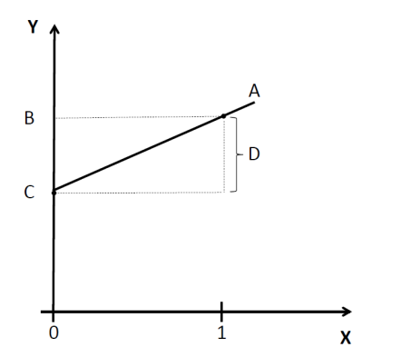
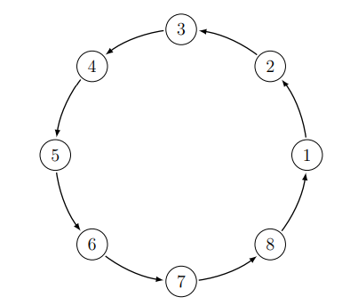

```{r setup, include=FALSE}
knitr::opts_chunk$set(echo = TRUE)
```


# Problem Set 1.

## 1.1. Unbiased Estimator.

### 1.1.a. Consider a population $y_i$ of size $N$, where $i=1, \ldots, N$. Suppose we draw from the population a random sample of size $n$, and define an indicator variable $z_i$, where $z_i=1$ if unit $i$ was sampled and $z_i=0$ otherwise. Notice that $z_i$ is the only random variable in this scenario.

**The population mean is $\mu_y=\frac{1}{N} \sum_{i=1}^N y_i$. Consider the estimator $\tilde{y}_i=\frac{1}{n} \sum_{i=1}^N z_i y_i$. Intuitively, what does $\tilde{y}_i$ represent? Show that it is an unbiased estimator of $\mu_y$. Would this still be true if we did not have a simple random sample (e.g., if we were more likely to sample higher values of $y_i$ than lower values)?**

- $\tilde{y}_i$ represents the sample mean, an estimate of the population mean.
- Note that  $z_{i}$ is a random variable with two possible outcomes: $z_i \in \{0,1 \}$. This represents a Bernoulli probability distribution, which has an expected value of $p$, the probability of success $\Pr(z_{i}=1)$. In this case, we know that $z_{i}=1$ exactly $n$ times where $n$ is the number of units in the population $y_{i}$ that were randomly sampled. Furthermore, $z_{i}=0$ exactly $N-n$ times. Then the probability that $z_{i}=1$ is: $\Pr\left(z_{i}=1\right) = \frac{n}{N}$
  - Thus, the Bernoulli distribution has the following expected value: $\mathbb{E}\left[z_{i}\right]=\frac{n}{N}$
- An estimator is unbiased if $\mathbb{E}(\tilde{y}_i - \mu_y) = 0 \Rightarrow \mathbb{E}(\tilde{y}_i) = \mu_y$. Let's prove this:

\begin{align*}
\mathbb{E}(\tilde{y}_i) &= \mathbb{E}\left[\frac{1}{n} \sum_{i=1}^N \left( z_i y_i \right) \right] && (\text{By Definition of $\tilde{y}_i$}) \\
&= \frac{1}{n}\mathbb{E}\left[ \sum_{i=1}^N \left( z_i y_i \right) \right] \\
&= \frac{1}{n}\sum_{i=1}^N\left[\mathbb{E} \left( z_i y_i \right) \right] && (\text{By linearity of expectation}) \\
&= \frac{1}{n}\sum_{i=1}^N\left[y_i \mathbb{E} \left( z_i \right) \right] && (\text{$y_i$ is not a random variable}) \\
&= \frac{1}{n}\sum_{i=1}^N\left[y_i \cdot \frac{n}{N} \right] && (\text{By 1st moment of Bernoulli distribution.}) \\
&= \frac{1}{n} \cdot \frac{n}{N} \sum_{i=1}^N\left[y_i \right] \\
&= \frac{1}{N} \sum_{i=1}^N\left[y_i \right] \\
&= \mu_y && (\text{As desired.})
\end{align*}

- This would not still be true if we lacked a simple random sample. If we were to over-sample higher values of $y_i$ than lower values, then $\mathbb{E}(\tilde{y}_i) > \mu_y$.

---

## 1.2. Potential Outcome Notation. 

**This problem should help you get familiar with the potential outcomes notation. Try to keep your answers brief and your language precise. Throughout the problem, assume that the Stable Unit Treatment Value Assumption (SUTVA) holds**.

### 1.2.a. Explain the notation $Y_i(0)$.

- $Y_i(0)$ is observation $i$'s potential outcome with no treatment (i.e., under the control condition).

### 1.2.b. Contrast the meaning of $Y_i(0)$ with the meaning of $Y_i$.

- $Y_i$ is the variable of interest. It has two potential outcomes based on if it receives treatment or not (see equation below). $Y_i(0)$ is the potential outcome for $Y_i$ when it doesn't treatment (i.e., under the control condition). 

$$
Y_{i}(d)= \begin{cases}Y_{i}(1) & \text { Potential outcome for unit } i \text { with treatment } \\ Y_{i}(0) & \text { Potential outcome for unit } i \text { without treatment }\end{cases}
$$

### 1.2.c. Contrast the meaning of $Y_i(0)$ with the meaning of $Y_i(1)$. Is it ever possible to observe both at the same time? Why?

- $Y_i(0)$ is the potential outcome of variable $Y$ for unit $i$ under control (i.e., no treatment).
- $Y_i(1)$ is the potential outcome of variable $Y$ for unit $i$ under treatment.
- It is not possible to observe both potential outcomes at the same time because we cannot observe both $Y_i(1)$ and $Y_i(0)$ for the same $i$ at the same time. This is the fundamental problem of causal inference.

### 1.2.d. Explain the notation $\mathbb{E}\left[Y_i(0) \mid D_i=1\right]$, where $D_i$ is a binary variable that gives the treatment status for subject $i, 1$ if treated, 0 if control.

- $\mathbb{E}\left[Y_i(0) \mid D_i=1\right]$ is the expected value of the potential outcome for $Y_i$ when unit $i$ does not receive treatment, conditional on unit $i$ receives treatment.

### 1.2.e. Contrast the meaning of $\mathbb{E}\left[Y_i(0)\right]$ with the meaning of $\mathbb{E}\left[Y_i \mid D_i=0\right]$.

- $\mathbb{E}\left[Y_i(0)\right]$ is $Y_i$'s potential outcome when $Y_i$ doesn't receive treatment (i.e., under the control).
- $\mathbb{E}\left[Y_i \mid D_i=0\right]$ is the expected value of \textit{both} potential outcome for $Y_i$ when unit $i$ does not receive treatment, conditional on unit $i$ receives treatment.
- \textbf{Difference}: the former quantity ($\mathbb{E}\left[Y_i(0)\right]$) includes only one potential outcome, while the latter quantity ($\mathbb{E}\left[Y_i \mid D_i=0\right]$) includes \textit{both} potential outcomes for $Y_i$ conditional on unit $i$ not receiving treatment. [\textcolor{red}{More elaboration??}]


### 1.2.f. Contrast the meaning of $\mathbb{E}\left[Y_i(0) \mid D_i=1\right]$ with the meaning of $\mathbb{E}\left[Y_i(0) \mid D_i=0\right]$.

- $\mathbb{E}\left[Y_i(0) \mid D_i=1\right]$ is the expected value of the potential outcome for $Y_i$ when unit $i$ is not treated, conditional on unit $i$ receiving treatment.
- $\mathbb{E}\left[Y_i(0) \mid D_i=0\right]$ is similar except it's conditional on unit $i$ \textit{not} receiving treatment.

### 1.2.g. Which of the following expectations (that you explained in parts (d) through (f)) can be identified from observed information? Do not make any additional assumptions about the distributions of $Y$ or $D$, except that there is at least one observation with $D_i=1$, and at least one with $D_i=0$ in the observed data.

$$
\begin{aligned}
& \mathbb{E}\left[Y_i(0) \mid D_i=1\right] \\
& \mathbb{E}\left[Y_i(0)\right] \\
& \mathbb{E}\left[Y_i \mid D_i=0\right] \\
& \mathbb{E}\left[Y_i(0) \mid D_i=0\right]
\end{aligned}
$$

- Let's address each of these in turn:
- $\mathbb{E}\left[Y_i(0) \mid D_i=1\right]$ is \textbf{not observable} because it's not an actualizable quantity.
  - Note that this quantity is the potential outcome for $Y_i$ when unit $i$ doesn't receive treatment, conditional on unit $i$ receiving treatment. 
- $\mathbb{E}\left[Y_i(0)\right]$ is generally \textbf{not observable} in experimental settings because it requires that all units receive no treatment (i.e., the control condition), which would be a terrible experiment! 
  - Note that this quantity is the expected value of the potential outcome for $Y_i$ when unit $i$ does not receive treatment.
- $\mathbb{E}\left[Y_i \mid D_i=0\right]$ is \textbf{not observable} because it requires us to know both potential outcomes ($Y_i(0)$ and $Y_i(1)$) conditional on unit $i$ not receiving treatment, but we cannot observe $Y_i(1)$ when unit $i$ doesn't receive treatment.
  - Note that this quantity is the expected value of \textit{both} potential outcome for $Y_i$ when unit $i$ does not receive treatment, conditional on unit $i$ receives treatment.
- $\mathbb{E}\left[Y_i(0) \mid D_i=0\right]$: is the only \textbf{observable} quantity. It's the only one where the potential outcome (i.e., $Y_i(0)$) and treatment status (i.e., $D_i = 0$) line up.
  - Note that this quantity is the expected value of the potential outcome for $Y_i$ when unit $i$ does not receive treatment, conditional on unit $i$ not receiving treatment.

---

## 1.3. BONUS QUESTION: Define SUTVA, both formally and substantively.

- **Stable Unit Treatment Value Assumption (SUTVA)**: an assumption that consists of two conditions/assumptions.
  - \underline{\textbf{No Interference} between units}: potential outcomes for a unit must not be affected by treatment for any other units.
    - Violations: spill-over effects, contagion, dilution.
  - \underline{\textbf{Same Version} of the treatment}. (i.e., treatment stability, consistency.
    - Violations: variable levels of treatment, technical errors
- **SUTVA**, formal definition:

$$
Y_{\left(D_1, D_2, \ldots, D_N\right) i}=Y_{\left(D_1^{\prime}, D_2^{\prime}, \ldots, D_N^{\prime}\right) i} \quad \text { if } \quad D_i=D_i^{\prime}
$$

---

\newpage

# Problem Set 2.

## 2.2. OLS Estimator.

### 2.2.a. (***) We can describe an observed outcome variable $\mathbf{y}$ as a function of the explanatory variables $\mathbf{X}$ in the following form: $\mathbf{y}=\mathbf{X} \hat{\beta}+\hat{\mathbf{u}}$, where $\mathbf{y}$ is a column vector of length $n$, $\mathbf{X}$ is an $n \times k$ matrix, $\hat{\beta}$ is a column vector of length $k$, and $\hat{\mathbf{u}}$ is a column vector of length $n$. Given this setup, consider the following quantity (where ' indicates transpose):

$$
(\mathbf{y}-\mathbf{X} \hat{\beta})^{\prime}(\mathbf{y}-\mathbf{X} \hat{\beta})
$$

**What does this quantity represent in the terminology of linear regression theory? Using matrix notation, solve for $\hat{\beta}$ such that this quantity is minimized. What conditions are required such that your solution for $\hat{\beta}$ is well-defined?**

- This quantity represents the **sum of squared residuals**---or **Residual Sum of Squares (RSS)**---in linear regression theory. 
  - Specifically, it's how much of the variance in the outcome variable is unexplained by the linear regression model. 
  - Generally, it's a measure of the discrepancy between the (observed) values of the outcome variable and the (predicted) values of the linear regression model.
- Let's solve for $\hat{\beta}$ such that this quantity is minimized in the proof below. We can do this in three easy steps:
  - First, simplify the residual sum of squares expression.
  - Second, take the first derivative of with respect to $\hat{\beta}$.
  - Third, set this first derivative equal to zero and solve for $\hat{\beta}$.

$$
\begin{aligned}
  \text{RSS} &= (\mathbf{y}-\mathbf{X} \hat{\beta})^{\top}(\mathbf{y}-\mathbf{X} \hat{\beta}) && (\text{By definition of RSS}) \\
  &= \left(\mathbf{y}^{\top}-\hat{\beta}^{\top} \mathbf{X}^{\top}\right) (\mathbf{y}-\mathbf{X} \hat{\beta}) && \text{(Distribute transpose)} \\
  &= \mathbf{y}^{\top} \mathbf{y}-\mathbf{y}^{\top} \mathbf{X} \hat{\beta}-\hat{\beta}^{\top} \mathbf{X}^{\top} \mathbf{y}+\hat{\beta}^{\top} \mathbf{X}^{\top} \mathbf{x} \hat{\beta} && \text{(Multiply out RHS)} \\
  &= \mathbf{y}^{\top} \mathbf{y}-2 \mathbf{y}^{\top} \mathbf{X} \hat{\beta}+\hat{\beta}^{\top} \mathbf{X}^{\top} \mathbf{x} \hat{\beta} && (\text{Combine like terms}) \\
  \frac{\partial \text{RSS}}{\partial \hat{\beta}} &= \frac{\partial }{\partial \hat{\beta}} \left[\mathbf{y}^{\top} \mathbf{y}-2 \mathbf{y}^{\top} \mathbf{X} \hat{\beta}+\hat{\beta}^{\top} \mathbf{X}^{\top} \mathbf{X} \hat{\beta} \right]  && (\text{Take derivative w.r.t $\hat{\beta}$}) \\
  &= \mathbf{X}^{\top} \mathbf{y}-\left(\mathbf{X}^{\top} \mathbf{X}\right) \hat{\beta} && (\text{Perform derivative}) \\
  0 & =\mathbf{X}^{\top} \mathbf{y}-\left(\mathbf{X}^{\top} \mathbf{X}\right) \hat{\beta} && (\text{Set equal to zero}) \\
  \left(\mathbf{X}^{\top} \mathbf{X}\right) \hat{\beta} & =\mathbf{X}^{\top} \mathbf{y} && (\text{Isolate $\hat{\beta}$}) \\
  \hat{\beta} & =\left(\mathbf{x}^{\top} \mathbf{X}\right)^{-1} \mathbf{X}^{\top} \mathbf{y} && (\text{Multiply by inverse}) \\
 & && \text{(As desired)}
\end{aligned}
$$

- The following condition is required for the above solution (i.e., the $\hat{\beta}$ that minimizes RSS) to be well-defined:
  - **No Perfect Collinearity**: none of the covariates are linearly dependent on other covariates (or combinations of other covariates). Linear dependence would make would make $\left(\mathbf{x}^{\top} \mathbf{X}\right)^{-1}$ impossible to calculate.

---

### 2.2.b. (***) Show that the conditional expectation function $\mathbb{E}[\mathbf{y} \mid \mathbf{X}]$ is equivalent to $\mathbf{X} \beta$ for a linear regression model $\mathbf{y}=\mathbf{X} \beta+\mathbf{u}$ under the zero conditional mean assumption. (Make sure to state what that assumption is using appropriate notation.) In precise language, explain what the conditional expectation function is.

- **Zero Conditional Mean Assumption** (ZCMA): we assume that, on average, the error term will have a mean of zero, even when conditioned on all covariate values.
  - Formal expression:

$$
\mathbb{E}(u | \mathbf{X}) = \mathbb{E}(u) = 0
$$

- Show that $\mathbb{E}[\mathbf{y} \mid \mathbf{X}] = \mathbf{X} \beta$ under the zero conditional mean assumption (ZCMA):

$$
\begin{aligned}
\mathbb{E}[y \mid \mathbf{X}] &= \mathbb{E}(\mathbf{X} \beta+u \mid \mathbf{X})  && \text{(By given linear regression equation)} \\
  &= \mathbb{E}(\mathbf{X} \beta \mid \mathbf{X})+\mathbb{E}(u \mid \mathbf{X}) && (\text{Distribute expectation}) \\
  &= \mathbf{X} \beta + \mathbb{E}(u \mid \mathbf{X}) && (\text{By rules of expectation and conditional expectation}) \\
  &= \mathbf{X} \beta + 0  && (\text{By zero conditional mean assumption, $u\perp \!\!\! \perp \mathbf{X}$}) \\
  &= \mathbf{X} \beta && \text{(As desired)}
\end{aligned}
$$

- I now explain what the conditional mean function is (in plain language):
  - By design, the error term $u$ is $0$ in expectation. 
  - We further assume heteroskedasticity--that the error term is uncorrelated with the matrix $\mathbf{X}$. 
  - Then, conditioning on $\mathbf{X}$ changes nothing about the expectation of $u$ (adds no information since they are uncorrelated) and it remains 0.


---

\newpage

### 2.2.c. Consider the following data and corresponding graph (figure 1---2.2.c graph) which plots the population regression function of $Y$ on $X$ (represented as A in the graph), which we assume to be linear such that $\mathbb{E}[Y \mid X]=\beta_0+\beta_1 X$. First, express the quantities corresponding to $B$, $C$ and $D$ in terms of the conditional expectations of $X$ and $Y$. Second, express $B, C$ and $D$ in the graph in terms of $\beta_0$ and $\beta_1$. Finally, use the provided data to estimate $B, C, D, \beta_0$ and $\beta_1$.

$$
\begin{array}{cc}
\hline \mathrm{X} & \mathrm{Y} \\
\hline 0 & 1 \\
0 & 3 \\
1 & 5 \\
1 & 7
\end{array}
$$



- First, express the quantities corresponding to $B$, $C$ and $D$ in terms of the conditional expectations of $X$ and $Y$. 
  - $B = \mathbb{E}[Y | X = 1]$.
  - $C = \mathbb{E}[Y | X = 0]$.
  - $D = \mathbb{E}[Y | X = 1] - \mathbb{E}[Y | X = 0]$.
- Second, express $B, C$ and $D$ in the graph in terms of $\beta_0$ and $\beta_1$. 
  - $B = \beta_0 + \beta_1$.
  - $C = \beta_0$. 
  - $D = B - C = \beta_1$.
- Finally, use the provided data to estimate $B, C, D, \beta_0$ and $\beta_1$.
  - $B = \mathbb{E}[Y | X = 1] = \frac{5 + 7}{2} = 6$.
  - $C = \mathbb{E}[Y | X = 0] = \frac{1 + 3}{2} = 2$.
  - $D = \mathbb{E}[Y | X = 1] - \mathbb{E}[Y | X = 0] = 6 - 2 = 4$.
  - $\beta_0 = C = 2$.
  - $\beta_1 = D = 4$.

---


\newpage

### 2.2.d. (***) Now we will derive the variance covariance matrix for $\hat{\beta}$. Assume that $\mathbb{E}\left[\mathbf{u} \mathbf{u}^{\prime} \mid \mathbf{X}\right]=\sigma^2 \mathbf{I}$, where $\mathbf{I}$ denotes the $n \times$ $n$ identity matrix. Given your result for $\hat{\beta}$ from (a) and given that we can write $\hat{\beta}$ as $\hat{\beta}=\beta+\left(\mathbf{X}^{\prime} \mathbf{X}\right)^{-1} \mathbf{X}^{\prime} \mathbf{u}$, derive the variance of the OLS estimator $\hat{\beta}$ using matrix notation. (Hint: Remember that the variance of a random variable is defined as the expected value of the squared deviation from the mean.)

[**\textcolor{red}{NOT ANSWERED}**]


---

## 2.3. Ghana's 2016 Election.

### 2.3.a. Assume that both parts of SUTVA hold. Calculate, explaining your answer:

#### 2.3.a.i. For each polling station $i$, the number of potential outcomes that can be defined.

[**\textcolor{red}{NOT ANSWERED}**]


#### 2.3.a.ii. For each polling station $i$, the number of unit treatment effects that can be defined.

[**\textcolor{red}{NOT ANSWERED}**]


#### 2.3.a.iii. For the sample of polling stations, the number of (unconditional) average treatment effect estimands that can be defined.

[**\textcolor{red}{NOT ANSWERED}**]


### 2.3.b. A Ghanaian political insider gets wind of your study, and gives you some information. She says that because all of the polling stations in your study are within one small constituency, there will be interference between units. She explains how "interference" might occur in this case: In Ghana, the political operatives in each polling station who are responsible for committing fraud will move elsewhere if their efforts are frustrated. Their range of movement is predetermined by the geographic influence of the party bosses. Local conditions are such that the operatives in each polling station can only move to one, and only one, other polling station, as shown in Figure 2 (2.3.b graph).





**Given this structure, again answer questions (i) - (iii).**

#### 2.3.b.i. For each polling station $i$, the number of potential outcomes that can be defined.

[**\textcolor{red}{NOT ANSWERED}**]


#### 2.3.b.ii. For each polling station $i$, the number of unit treatment effects that can be defined.

[**\textcolor{red}{NOT ANSWERED}**]


#### 2.3.b.iii. For the sample of polling stations, the number of (unconditional) average treatment effect estimands that can be defined.

[**\textcolor{red}{NOT ANSWERED}**]


### 2.3.c. Your funder is keen to spend their budget, and demands that you field the intervention as described originally: $N=8$, and for $D_i=\{0,1\}, \sum_{i=1}^N D_i=4$. You set aside your concerns, and observe the data in Table 1 on the percentage of votes in each polling station attributable to fraud.

**Write out an appropriate estimator for the average treatment effect (ATE) given SUTVA. Drawing on your insights so far and your knowledge of causal inference, under what conditions will this estimator be unbiased? Apply it to the data and compute an estimate of the effect of the new biometric voting machines on the incidence of fraud.**

$$
\begin{aligned}
&\text { Table 1: Observed Data: Treatment and Ballot Stuffing }\\
&\begin{array}{c|c|c}
\hline \hline \text { Unit } & D_i & Y_i \\
\hline 1 & 1 & 4 \% \\
2 & 1 & 2 \% \\
3 & 0 & 8 \% \\
4 & 1 & 9 \% \\
5 & 0 & 12 \% \\
6 & 0 & 13 \% \\
7 & 0 & 4 \% \\
8 & 1 & 1 \% \\
\hline
\end{array}
\end{aligned}
$$

[**\textcolor{red}{NOT ANSWERED}**]


### 2.3.d. Given that you know the structure of the interference network, you believe you may be able to rescue something from the study. Using Figure 1 , translate Table 1 into a table formatted like Table 2 , where the latter columns give $Y_i\left(D_i, D_{i-1}\right)$ for the combinations of possible values for $D_i$ and $D_{i-1}$. (And for $i=1, Y_1\left(D_1, D_8\right)$, per Figure 1 ). Where you can, fill the cells of your table with values from Table 1 ; leave blank the cells representing unobserved potential outcomes.

$$
\begin{aligned}
&\text { Table 2: Observed and Unobserved Potential Outcomes }\\
&\begin{tabular}{l|l|l|l|l|l|l}
\hline \hline Unit & $D_i$ & $D_{i-1}$ & $Y_i(1,1)$ & $Y_i(1,0)$ & $Y_i(0,1)$ & $Y_i(0,0)$ \\
\hline 1 & & & & & & \\
$\vdots$ & & & & & & \\
8 & & & & & & \\
\hline
\end{tabular}
\end{aligned}
$$

[**\textcolor{red}{NOT ANSWERED}**]


### 2.3.e. Formally express each of the estimands described below using potential outcomes; propose appropriate estimators for each; and finally estimate them with the help of your new table.

#### 2.3.e.i. The ATE, conditional on a neighbor taking treatment.

[**\textcolor{red}{NOT ANSWERED}**]


#### 2.3.e.ii. The ATE, conditional on a neighbor taking control.

[**\textcolor{red}{NOT ANSWERED}**]


#### 2.3.e.iii. The magnitude of effect modification due to assignment of treatment to a neighboring unit.

[**\textcolor{red}{NOT ANSWERED}**]


\newpage

# Problem Set 3.

## 3.3. ATE and the Difference-in-Means Variance.

**Consider a field experiment that compares treatments A and B (You can think of B as the absence of a treatment, i.e. the "treatment" received by the control group). Suppose there are $N$ subjects, indexed by $i=1, \ldots, N$. Let $x_i$ be the response of subject $i$ to treatment $A$; likewise, $y_i$ is the response to receiving treatment $B$ (the control). For each $i$, either $x_i$ or $y_i$ can be observed, but not both. Let $S$ be a random subset of $\{1, \ldots, N\}$, with $n$ elements; this group gets treatment A, so $x_i$ is observed for $i$ in $S$. Let $T$ be a random subset of $\{1, \ldots, N\}$, with $m$ elements, disjoint from $S$. This group gets treatment $B$, so $y_i$ is observed for $i$ in $T$.**

**We estimate population means $\bar{x}$ and $\bar{y}$ by the sample means:**

$$
\bar{X}=\frac{1}{n} \sum_i^n x_i \quad \bar{Y}=\frac{1}{m} \sum_i^m y_i
$$

**Using simple sampling without replacement formulas:**

$$
\begin{gathered}
\operatorname{var}(\bar{X})=\frac{N-n}{N-1} \frac{\sigma^2}{n} \quad \operatorname{var}(\bar{Y})=\frac{N-m}{N-1} \frac{\tau^2}{m} \\
\operatorname{cov}(\bar{X}, \bar{Y})=-\frac{1}{N-1} \operatorname{cov}(x, y)
\end{gathered}
$$

### 3.3.a. What is the average treatment effect parameter? Write it using the above notation and also explain what it is in words.

[**\textcolor{red}{NOT ANSWERED}**]


### 3.3.b. What is the variance of the average treatment effect estimator, i.e. $\operatorname{var}(\bar{X}-\bar{Y})$, using the above notation?

[**\textcolor{red}{NOT ANSWERED}**]


### 3.3.c. The usual two sample difference-in-means variance (without replacement) found in sampling textbooks is:

$$
\frac{N}{N-1}\left(\frac{\sigma^2}{n}+\frac{\tau^2}{m}\right)
$$

**What is the difference, if any, between the usual two sample difference-in-means variance and the "true" variance expression you derived in part b? Can we observe this difference in the data we have?**

[**\textcolor{red}{NOT ANSWERED}**]


\newpage

# Problem Set 5.

## 5.1. Curse of Dimensionality.

**The curse of dimensionality makes it difficult to work in a situation where there are many pre-treatment covariates to condition on. Suppose we have covariates $X_k$ for $k=1, \ldots, P$, where $P$ is the number of pre-treatment covariates (i.e., the dimensionality of the covariate space). Then $x_i$ is a vector of covariate values for observation $i, x_i=\left[x_{i 1}, \ldots, x_{i P}\right]^T$.**

### 5.1.a. Write an expression that gives the Euclidean distance between observations $i$ and $j$ in terms of their covariates $x_i$ and $x_j$, respectively.

[**\textcolor{red}{NOT ANSWERED}**]


\newpage

# Problem Set 6.

## 6.1. Fictitious Observational Study.

**The table below summarizes outcomes from a fictitious observational study assessing whether receiving assistance from one's elected representative after making a request for assistance increases political self-efficacy. Data come from a survey of 800 constituents who made requests to their representatives. The survey measured political self-efficacy using a thermometer-style scale ranging from 0 to 100 . We'll denote the outcome $Y_i$, for constituents $i=1, \ldots, N$, and the treatment $D_i \in\{0,1\}$. Our quantity of interest is the average effect of receiving a representative's assistance on a constituent's self-efficacy, $\tau=\mathbb{E}\left[Y_i(1)-Y_i(0)\right]$, the ATE.**

\begin{center}
\begin{tabular}{cc}
\hline$D_i$ & $\mathbb{E}\left[Y_i\right]$ \\
\hline 1 & 73 \\
0 & 56 \\
\hline
\end{tabular}
\end{center}

**The survey also measured constituent income, coded in our data as a discrete covariate $X_i \in\{1,2,3\}$, indicating low, middle, and high income. In the sample, $50 \%$ of constituents are low-income, $30 \%$ are middle-income, and $20 \%$ are high-income. Frequencies by income level are displayed in the following table.**

\begin{center}
\begin{tabular}{ccccc}
\hline Freq. & $X_i=1$ & $X_i=2$ & $X_i=3$ & Total \\
\hline$D_i=1$ & 212 & 163 & 125 & 500 \\
$D_i=0$ & 188 & 77 & 35 & 300 \\
Total & 400 & 240 & 160 & 800 \\
\hline
\end{tabular}
\end{center}

**Throughout this problem, assume that the observed data represent the entire population of interest and the variables are measured without error, so that we can ignore sampling variability. (In real applied settings, you would want to incorporate sampling uncertainty and report confidence intervals, etc., as part of your result.)**

### 6.1.a. Write an expression for $\tau$ using the expressions in the following table. Then create a similar table that replaces the expressions in each cell with actual values, using only the observed data from this study. Leave the original expression in any cell you cannot populate with a value from the observed data.

\begin{center}
\begin{tabular}{cccc}
\hline$d$ & $\operatorname{Pr}\left(D_i=d\right)$ & $\mathbb{E}\left[Y_i(1) \mid D_i=d\right]$ & $\mathbb{E}\left[Y_i(0) \mid D_i=d\right]$ \\
\hline 1 & $\operatorname{Pr}\left(D_i=1\right)$ & $\mathbb{E}\left[Y_i(1) \mid D_i=1\right]$ & $\mathbb{E}\left[Y_i(0) \mid D_i=1\right]$ \\
0 & $\operatorname{Pr}\left(D_i=0\right)$ & $\mathbb{E}\left[Y_i(1) \mid D_i=0\right]$ & $\mathbb{E}\left[Y_i(0) \mid D_i=0\right]$ \\
\hline
\end{tabular}
\end{center}

[**\textcolor{red}{NOT ANSWERED}**]


### 6.1.b. Suppose you have some reason to be concerned about the identifying assumption of conditional ignorability. Calculate sharp bounds for $\tau$ without making any assumptions at all. Explain in simple, concise language what these bounds represent. You may find it helpful to use the table you produced in part (a) and fill in the values that produce the upper and lower no-assumptions sharp bounds.

[**\textcolor{red}{NOT ANSWERED}**]


### 6.1.c. One possible threat to identification is that constituents with higher self-efficacy are more likely to follow up on their requests, and in turn more likely to receive assistance from their representatives (assume follow-up requests are not captured in the survey). If this were the case, treated constituents would tend to have greater self-efficacy than untreated units, whether or not they received treatment. State this assumption formally and use it to calculate new bounds.

[**\textcolor{red}{NOT ANSWERED}**]


### 6.1.d. Now consider that elected representatives have limited time and resources and must make strategic decisions about which requests to prioritize. Representatives want to maximize the probability of winning re-election, and they know there are greater payoffs to responding to requests from high income people, who more likely to both turn out and make large campaign donations. Assume representatives can accurately guess a constituent's income level based on factors like the constituent's address and the type of request. As a result of this incentive structure, the probability of response to requests from high-income constituents is unrelated the number of times they follow up (and therefore unrelated to pre-existing levels of self-efficacy). For low- and middle-income constituents, however, positive self-selection may still hold. Express this assumption formally. Would the resulting bounds be more or less credible than those under your assumption in (c)? Explain.

[**\textcolor{red}{NOT ANSWERED}**]


### 6.1.e. Use the assumption described in (d) and the following table of conditional expectations to calculate new bounds.

\begin{tabular}{ccccc}
\hline$D_i$ & $\mathbb{E}\left[Y_i\right]$ & $\mathbb{E}\left[Y_i \mid X_i=1\right]$ & $\mathbb{E}\left[Y_i \mid X_i=2\right]$ & $\mathbb{E}\left[Y_i \mid X_i=3\right]$ \\
\hline 1 & 73 & 69 & 73 & 83 \\
0 & 56 & 51 & 55 & 70 \\
\hline
\end{tabular}

[**\textcolor{red}{NOT ANSWERED}**]


\newpage

# Problem Set 7.

## 7.1. The IV Estimator.

### 7.1.a. Suppose that we are interested in the effect of a potentially endogenous causal variable $X_i$ on an outcome variable of interest $Y_i$. Assume that we have another variable $Z_i$, which is binary and is an instrumental variable for $X_i$. Show that the IV estimator for the effect of $X_i$ on $Y_i$

$$
\hat{\beta}_{I V}=\frac{\operatorname{cov}\left(Z_i, Y_i\right)}{\operatorname{cov}\left(Z_i, X_i\right)}
$$

**Can be written as**

$$
\frac{\left(\bar{Y}_1-\bar{Y}_0\right)}{\left(\bar{X}_1-\bar{X}_0\right)},
$$

**where $\operatorname{cov}(\cdot)$ is the sample covariance; $\bar{Y}_0$ and $\bar{X}_0$ are the sample averages of $Y_i$ and $X_i$ over the part of the sample with $Z_i=0$; and $\bar{Y}_1$ and $\bar{X}_1$ are the sample averages of $Y_i$ and $X_i$ over the part of the sample with $Z_i=1$.**

[**\textcolor{red}{NOT ANSWERED}**]


### 7.1.b. Let $\mathbf{X}=\left[1, X_1, X_2, \cdots, X_k, D\right]$ and $\mathbf{Z}=\left[1, X_1, X_2, \cdots, X_k, Z\right]$. The matrix $\mathbf{X}$ contains the covariates (including a vector of 1s) and your treatment vector $D$, and $\mathbf{Z}$ is a matrix of the same covariates and the instrument for the treatment variable in place of the actual treatment. $Y$ is a vector of observed outcomes. We can construct the following system of linear equations, with error terms $u_2$ and $u_1$ respectively:

$$
\begin{aligned}
Y & =\mathbf{X} \beta+u_2 \\
D & =\mathbf{Z} \pi+u_1
\end{aligned}
$$

**with coefficient vectors $\beta=\left[\beta_0, \beta_1, \cdots, \beta_k, \beta_D\right]$ and $\pi=\left[\pi_0, \pi_1, \cdots, \pi_k, \pi_Z\right]$.**

**The IV estimator can be obtained by:**

$$
\hat{\beta}_{I V}=\left(\mathbf{Z}^{\prime} \mathbf{X}\right)^{-1} \mathbf{Z}^{\prime} Y
$$

#### 7.1.b.i. What are the conditions under which the treatment effect estimate $\hat{\beta}_{I V}$ is consistent?

[**\textcolor{red}{NOT ANSWERED}**]


#### 7.1.b.ii. Now let's obtain the Two-stage Least Squares estimator. We can do that following these next steps.

- **(a) Run the first stage regression: $D=\mathbf{Z} \pi+u_1 \Rightarrow \hat{\pi}=\left(\mathbf{Z}^{\prime} \mathbf{Z}\right)^{-1} \mathbf{Z}^{\prime} D$**
- **(b) Get fitted values: $\hat{D}=\mathbf{Z} \hat{\pi}$**
- **(c) Regress $Y$ on $\hat{\mathbf{X}}=\left[1, X_1, X_2, \cdots, X_k, \hat{D}\right]: Y=\hat{\mathbf{X}} \beta_{2 S L S}+u_3$**

**Show formally that $\hat{\beta}_{2 S L S}=\left(\hat{\mathbf{X}}^{\prime} \hat{\mathbf{X}}\right)^{-1} \hat{\mathbf{X}}^{\prime} Y=\left(\mathbf{Z}^{\prime} \mathbf{X}\right)^{-1} \mathbf{Z}^{\prime} Y=\hat{\beta}_{I V}$. Comment on the steps along the way to reach your conclusion. If you need any additional assumptions, please state them.**

[**\textcolor{red}{NOT ANSWERED}**]


---

## 7.3. The Colonial Origins of Comparative Development.

**In this problem we will assess one of the most famous social science articles using instrumental variables, Acemoglu, Johnson, \& Robinson's 2001 paper "The Colonial Origins of Comparative Development: An Empirical Investigation" (henceforth AJR).^[Thi paper has over 8,000 citations, and is heavily debated in a range of disciplines including economics, political science, and history. This problem set question is highly stylized, and if you are really interested in the substantive and methodological details of the paper we encourage you to read the paper and surrounding debates carefully. Also remember, it is always easier to criticise something than to build it yourself!]**

**First, we will begin with a stylized characterization of the study. Assume that AJR use the following variables for any country $i$ that was previously colonized:**

- **Instrument $Z_i \in\{0,1\}$ : Mortality in the 17th, 18th, and early 19th centuries, $0$ if low mortality, $1$ if high.**

- **Treatment $D_i \in\{0,1\}$ : Modern property rights institutions, $0$ if weak, $1$ if strong.**

- **Outcome $Y_i$ : Modern $\log$ GDP per capita.**

**In our stylized characterization, assume that AJR use instrumental variables to estimate the effect of $D_i$ on $Y_i$ by instrumenting for $D_i$ with $Z_i$. They find that having strong modern property rights institutions causes higher GDP per capita. (Note: As we will see in a minute, AJR include various specifications in which they also control for some pre-treatment covariates, but for now we will focus on the "simplest" empirical strategy.)**

### 7.3.b. Name the five assumptions underpinning instrumental variables as a strategy for identifying the effect of an endogenous treatment on the outcome for compliers. Write out each assumption formally in terms of $Z_i, D_i$, and $Y_i$. In your own words, interpret each assumption with regard to the specific setup of A.JR's study. Finally, discuss the plausibility of each assumption. (Hint: It may be useful to refer to your DAG from (a) in interpreting and assessing some assumptions.)

[**\textcolor{red}{NOT ANSWERED}**]


\newpage

# Problem Set 8.

## 8.2. RDD Assumptions.

### 8.2.a. Write down and explain the identification assumption required for the type of RDD you implemented in Problem 1.

[**\textcolor{red}{NOT ANSWERED}**]


### 8.2.b. Contrast this assumption with the assumptions required for identification under selection on observables. Why do we require this new assumption?

[**\textcolor{red}{NOT ANSWERED}**]


\newpage

# Problem Set 9.

## 9.1. Card and Krueger.

**Card and Krueger (1994) estimate the impact of changing the minimum wage on teenage employment. Conventional economic wisdom holds that raising the minimum wage reduces employment, especially among teenagers, who often earn the minimum wage. This is the main argument against raising it. Empirical analysis has failed to find evidence of an employment response to the minimum wage, however. In 1992, New Jersey's minimum wage increased from $\$ 4.25$ to $\$ 5.05$, while the minimum wage in Pennsylvania remained at $\$ 4.25$. The authors use data on employment at fast-food establishments in New Jersey and Pennsylvania before and after the increase in the minimum wage to estimate the impact of the increase in minimum wage on teenage employment.**

**Download `card_krueger.csv` from the course website. It contains the following variables, with one row corresponding to one fast-food restaurant:**

- **`state`: New Jersey or Pennsylvania**
- **`chain`: the fast-food chain to which the restaurant belongs**
- **`wage.pre`: starting wage in February 1992, in dollars per hour**
- **`wage.post`: starting wage in November 1992, in dollars per hour**
- **`emp.pre`: employment in February 1992, in number of full-time equivalent (FTE) employees**
- **`emp.post`: employment in November 1992, in number of full-time equivalent (FTE) employees**
- **`closed`: whether the store was closed in November 1992**

##$ 9.1.a. Assume that the fast-food restaurants surveyed by Card and Krueger represent a random sample from a larger population of all fast-food restaurants in New Jersey and Pennsylvania. Consider the quantities in Table 1, denoting the mean level of full-time equivalent (FTE) employment for restaurants by state and time. Define the article's difference-in-differences estimator in these terms. In your own words, what does the estimator represent?

\begin{tabular}{r|cc} 
& February & November \\
\hline New Jersey & $\alpha$ & $\beta$ \\
Pennsylvania & $\gamma$ & $\delta$
\end{tabular}

**Table 1: Average population FTE employment by state and time**

[**\textcolor{red}{NOT ANSWERED}**]


### 9.1.b. Consider potential mean FTE employment among treated and untreated restaurants, pre-treatment and post-treatment. Denote treatment group membership with $D_i$ for $d=\{0,1\}$, index treatment status with $z=\{0,1\}$ and index the period with $t=\{0,1\}$. (For a unit in the treatment group, $D_i=1$ in all periods and $z=D_i$ post-treatment.) Replace each element of Table 1 using expected potential outcomes $Y_{i t}(z)$ conditional on $D_i=d$. Then, define the differences-in-differences estimator and the causal quantity of interest, the ATT, in these same terms. What assumption is necessary to identify the ATT using the differences-in-differences estimator?

[**\textcolor{red}{NOT ANSWERED}**]


### 9.1.c. Can you find any evidence for the plausibility of your key identifying assumption in the data? Briefly explain.

[**\textcolor{red}{NOT ANSWERED}**]


---

## 9.2. Malesky et al.

**Malesky et al. (2014) study the effect of recentralizing public service provision in Vietnam. The study investigates the effect of the piloted removal of elected local councils from 99 districts across the country in 2009 using a difference-in-differences design with repeated cross-sectional data. The authors find that recentralization improved public service delivery in the transportation, healthcare, and communications sectors. In this problem we will replicate and probe the validity of some of their key results.**

**First, download the two datasets `maleskyetal.dta` and `maleskyetal_placebo.dta` from the course website. Both datasets include the following variables for each commune $i$:**

**The main specifications used in the paper implement the following model:**

$$
Y_{i t}=\alpha+T_t \beta+D_i \gamma+T_t D_i \theta+X_{i t}^{\top} \delta+\epsilon_{i t}
$$

**Where $i$ indicates a commune and $t$ a year. $T_t$ is an indicator variable for the treatment period, 1 after 2009, 0 before. $D_i$ is an indicator variable for the treatment group, 1 if in the treatment group, 0 if not. $X_{i t}$ are covariates (`lnarea`, `lnpopden`, `city`, and dummies for each value of `reg8`). The error terms in the model $\left(\epsilon_{i t}\right)$ are correlated within districts (`tinh`) but not across districts.**

### 9.2.a. Given the setup outlined above, create a three-by-three table (as in Slide 17 in the DID slides) that shows the meaning of each of $\alpha, \beta, \delta, \gamma$ and $\theta$. Which parameter gives the difference-in-differences, the causal quantity of interest in Malesky et al's study? Explain in your own words what each "difference" represents in the differencein-differences.

[**\textcolor{red}{NOT ANSWERED}**]


### 9.2.c. Given SUTVA, write down the key assumption required to identify the causal effect of recentralization. Interpret the assumption. Give an example, in the context of Malesky et al’s study, of a confounder that would violate this assumption.

[**\textcolor{red}{NOT ANSWERED}**]

